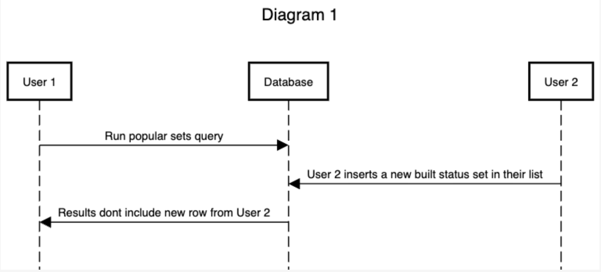
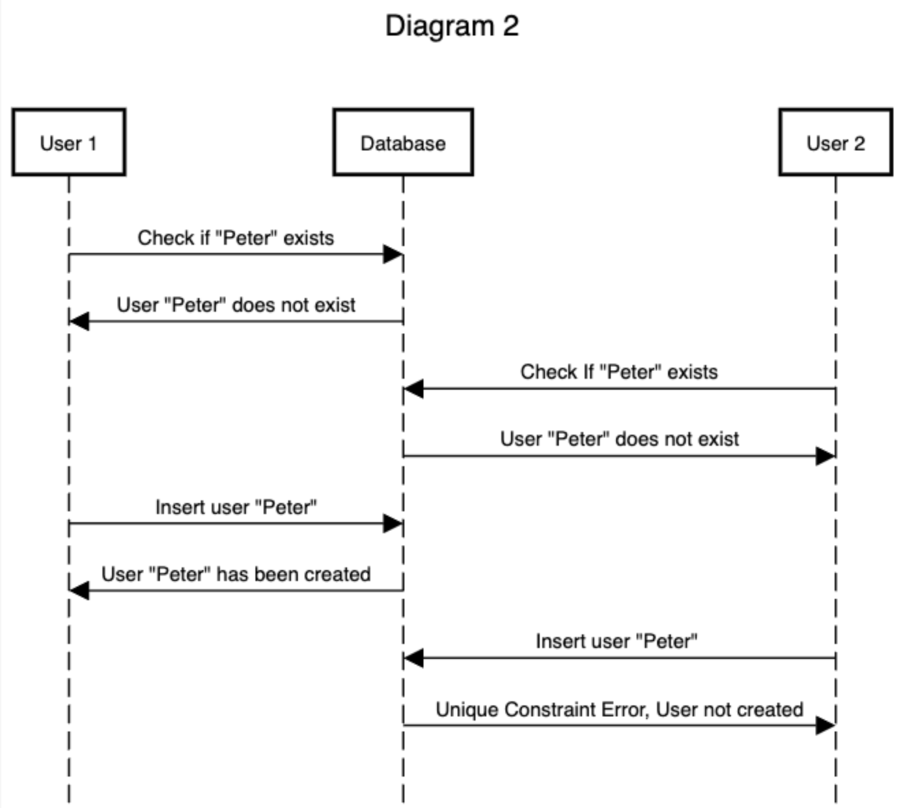

## 1. Phantom Read in Popular Sets Endpoint

**Scenario:**  
The `/analytics/popular-sets` endpoint computes the most popular sets for a given month by counting how many users marked a set as "built". If a new "built" status is inserted during this computation (e.g., if the query is run for the current month), theres a theoretical risk of inconsistent results if multiple queries were run within the same transaction. However, in our case this endpoint performs a single SELECT query.

Because Postgre uses MVCC, each individual query sees a consistent snapshot at the start of the query. Therefore, phantom reads wont occur unless multiple reads happen in the same transaction, which we do not do.

**Sequence Diagram:**

**Phenomenon:**  
Phantom Read — Would be possible if we re-queried inside the same transaction, but prevented here due to Postgres MVCC.

**Solution:**  
No changes needed. The use of a single read query ensures a consistent snapshot.

2. Race Condition When Creating Users with Duplicate Usernames

**Scenario:**
The `/users` endpoint checks if a username already exists before inserting a new user. If two users attempt to create an account with the same username like "Peter Griffin" at nearly the same time, both may pass the existence check before either inserts, resulting in a race condition.

If theres no database constraint, this may result in duplicate usernames. If a UNIQUE constraint is present, one of the inserts will fail, but the error will surface only after the application logic assumes the username is available.

**Sequence Diagram:**

**Phenomenon:**
Lost Update and Write Skew — Both users read that the name Peter is available and try to create, but only one is able to actually make that user

**Solution:** Ensure the username column has a UNIQUE constraint at the database level